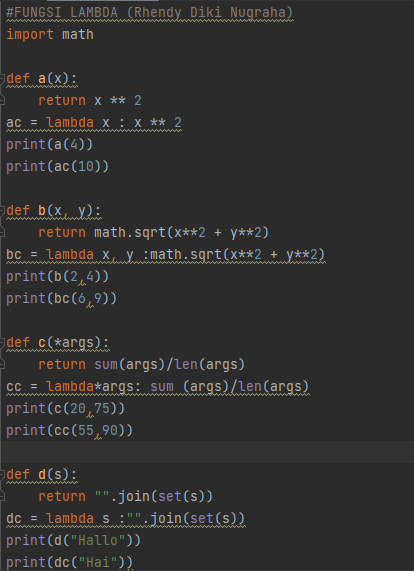
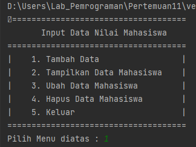
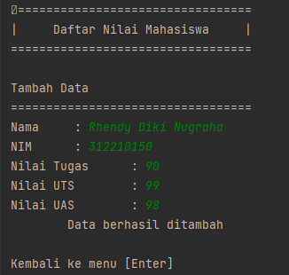
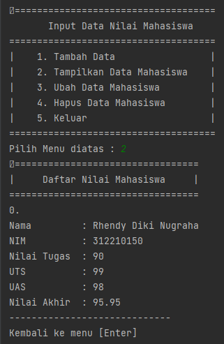
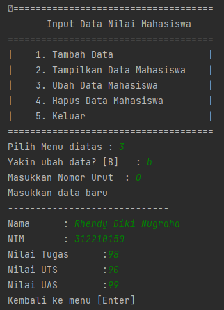
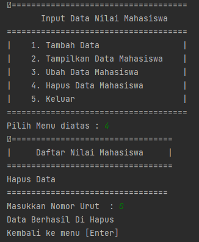
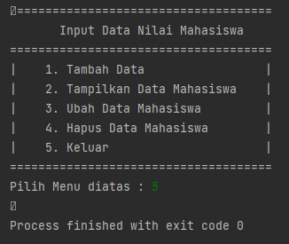
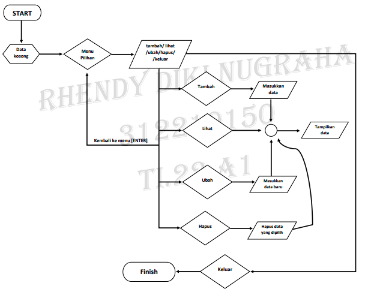

# Pertemuan 11
| No.| DAFTAR ISI | FILE          | GOTO                        |
|----|------------|---------------|-----------------------------|
| 1. | Latihan    | Latihan1.py   | [Menuju Kesini](#latihan)   |
| 2. | Praktikum  | Praktikum.py  | [Menuju Kesini](#praktikum) |
| 3. | Flowchart  | Flowchart.png | [Menuju Kesini](#flowchart) |
| 4. | Penutup    |               | [Menuju Kesini](#penutup)   |

Hallo, berjumpa lagi dengan Saya Rhendy... Pada repository kali ini, saya akan menunaikan tugas dari pertemuan 11, yaitu tentang Fungsi. Seperti biasa, akan ada Latihan dan Praktikum beserta flowchart yang nanti Saya sertakan pada repository ini.

## Latihan
Pada bagian Latihan ini, saya akan mengubah kode-kode dibawah ini menjadi sebuah fungsi, dengan menggunakan lambda.<br/>
Kode nya adalah sebagai berikut :<br/>
```
import math

def a(x):
return x**2

def b(x, y):
return math.sqrt(x**2 + y**2)

def c(*args):
return sum(args)/len(args)

def d(s):
return "".join(set(s))
```
Semua kode diatas ini, jika saya ubah menjadi sebuah program dan menggunakan lambda. Maka akan menjadi seperti ini :<br/>
<br/><br/>
dengan program seperti ini, maka akan menghasilkan sebuah RUN, seperti :<br/>
<br/><br/>
Latihan sudah berhasil dilakukan, selanjutnya Saya akan langsung membuat sebuah praktikum.
## Praktikum
Dalam praktikum ini, Saya diperintahkan untuk membuat sebuah program sederhana dengan mengaplikasikan fungsi. Program ini nantinya akan menampilkan daftar dari nilai mahasiswa, ketentuan program ini adalah :<br/>
• Ada Fungsi **tambah()** untuk menambah data<br/>
• Fungsi **tampilkan()** untuk menampilkan data<br/>
• Fungsi **hapus(nama)** untuk menghapus data berdasarkan nama<br/>
• Fungsi **ubah(nama)** untuk mengubah data berdasarkan nama<br/>
• Tambahkan juga flowchart dan penjelasan dari program ini.<br/>
Beginilah jika dituangkan kedalam program :
1. Pertama, kita membuat dictionary kosong, karena nantinya akan kita isi dengan input dari user.
```
form os import system
nama_m = []
nim_m = []
n_tugas = []
n_uts = []
n_uas = []
n_akhir = []

```
2. Setelah itu, buat judul dari programnya. Judul ini nantinya juga akan dipakai saat menampilkan data yang sudah direkam.
```
def judul():
    print('=================================')
    print('|     Daftar Nilai Mahasiswa     |')
    print('==================================')
```
3. Buat menu pilihan dengan menggunakan if else, nantinya kita akan diminta memilih menu apa yang akan kita akses.
```
def menu():
    system('cls')
    print('====================================')
    print('Input Data Nilai Mahasiswa'.center(40))
    print('=====================================')
    print('|    1. Tambah Data                 |')
    print('|    2. Tampilkan Data Mahasiswa    |')
    print('|    3. Ubah Data Mahasiswa         |')
    print('|    4. Hapus Data Mahasiswa        |')
    print('|    5. Keluar                      |')
    print('=====================================')
    choose = input('Pilih Menu diatas : ')
    if choose == '1':
        tambah()
    elif choose == '2':
        tampilkan()
    elif choose == '3':
        ubah()
    elif choose == '4':
        hapus()
    elif choose == '5':
        keluar()
    else:
        input('Menu Tidak Ada')

        menu()
```
4. Membuat syntax untuk menambahkan data. Input data akan terjadi ketika kita memilih 1.
```
def tambah():
    system('cls')
    judul()
    print('\nTambah Data')
    print('==================================')
    nama = input('Nama     : ')
    nama_m.append(nama)
    nim = input('NIM      : ')
    nim_m.append(nim)
    tugas = int(input('Nilai Tugas      : '))
    n_tugas.append(tugas)
    uts = int(input('Nilai UTS        : '))
    n_uts.append(uts)
    uas = int(input('Nilai UAS        : '))
    n_uas.append(uas)
    akhir = tugas * 0.30 + uts * 0.35 + uas * 0.35
    n_akhir.append(akhir)
    print('Data berhasil ditambah\n'.center(40))
    input('Kembali ke menu [Enter]')
    menu()
```
5. Membuat syntax untuk menampilkan data yang sudah kita input tadi. Data akan ditampilkan jika kita memilih 2.
```
def tampilkan():
    system('cls')
    judul()

    for i in range(len(nama_m)):
        print('%d.\nNama         : %s' % (i + 0, nama_m[i]))
        print('NIM          : %s' % nim_m[i])
        print('Nilai Tugas  : %.d' % n_tugas[i])
        print('UTS          : %.d' % n_uts[i])
        print('UAS          : %.d' % n_uas[i])
        print('Nilai Akhir  : %.2f' % n_akhir[i])
        print('-----------------------------')
    input('Kembali ke menu [Enter]')
    menu()
```
6. Membuat syntax untuk mengubah data. Data akan diubah saat kita memilih nomor 3. Nanti kita akan diminta memasukan lagi nomor urut, lalu ubah data dengan memasukkan data yang baru.
```
def ubah():
    y_ubah = input('Yakin ubah data? [B]   : ')
    if y_ubah == 'B' or y_ubah == 'b':
        i = int(input('Masukkan Nomor Urut  : '))

        if (i > len(nim_m[i])):
            print('Nomor Urut Salah')
        else:
            print('Masukkan data baru')
            print('-----------------------------')
            n_nama = input('Nama      : ')
            nama_m[i] = n_nama
            n_nim = input('NIM       : ')
            nim_m[i] = n_nim
            tugas_n = int(input('Nilai Tugas      :'))
            n_tugas[i] = tugas_n
            uts_n = int(input('Nilai UTS        :'))
            n_uts[i] = uts_n
            uas_n = int(input('Nilai UAS        :'))
            n_uas[i] = uas_n
    input('Kembali ke menu [Enter]')
    menu()
```
7. Lalu, membuat syntax untuk menghapus data yang sudah ditambahkan tadi. Dengan memilih nomor 4, maka kita akan diminta memasukkan nomor urut dari data yang akan dihapus.
```
def hapus():
    system('cls')
    judul()
    print('Hapus Data')
    print('=================================')
    i = int(input('Masukkan Nomor Urut  : '))

    if (i > len(nama_m)):
        input('Nama Tidak Ada [Enter]')
        menu()

    else:
        nama_m.remove(nama_m[i])
        nim_m.remove(nim_m[i])
        n_tugas.remove(n_tugas[i])
        n_uts.remove(n_uts[i])
        n_uas.remove(n_uas[i])
        n_akhir.remove(n_akhir[i])

    print('Data Berhasil Di Hapus')
    input('Kembali ke menu [Enter]')
    menu()
```
8. Dan, yang terakhir membuat syntax sederhana, untuk mengakhiri program.
```
def keluar():
    system('cls')

menu()
```
Program ini ketika di RUN, maka akan mendapat hasil seperti ini :<br/>
1. Menu pilihan akan muncul saat pertama kali program di RUN.<br/>
    <br/><br/>
2. Jika memilih 1, maka kita akan diminta untuk menambahkan data. Isi data sesuai dengan apa yang diperintahkan. Jika sudah, tekan ENTER untuk kembali ke menu pilihan.<br/>
    <br/><br/>
3. Lalu pilih 2 untuk menampilkan data yang sudah kita tambah tadi. Semua data yang ditambahkan akan ditampilkan.<br/>
    <br/><br/>
4. Untuk mengubah data yang sudah kita masukkan, pilih nomor 3. Nanti kita akan diminta untuk memasukkan data baru.<br/>
    <br/><br/>
5. Untuk menghapus. Kita hanya perlu memilih nomor 4, dan masukkan nomor urut dari data untuk menghapus data tersebut.<br/>
    <br/><br/>
6. Yang terakhir, pilih nomor 5. Ketika kita akan mengakhiri atau keluar program ini.<br/>
    <br/><br/>
Nah, Jadi itulah penjelasan dan cara kerja dari program yang telah dibuat ini. Selanjutnya akan saya sertekan flowchart dari program ini.

## Flowchart
<br/><br/>

## Penutup
Sudah sampai lagi kita dipenghujung repository kali ini. Sekian dari tugas yang sudah saya kerjakan, seperti biasa Saya memohon maaf bila ada kesalahan atau kekurangan dalam pengetikkan reporsitory ini. Terimakasih bagi yang sudah membaca sampai akhir atau hanya sekedar mampir. Sekali lagi saya ucapkan terimakasih.<br/><br/>

```
Nama    : Rhendy Diki Nugraha
NIM     : 312210150
Kelas   : TI.22.A1
Dosen   : Agung Nugroho, S.kom, M.kom
```