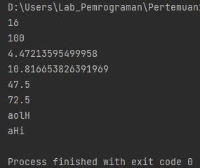

# Pertemuan 11
Hallo, berjumpa lagi dengan Saya Rhendy... Pada repository kali ini, saya akan menunaikan tugas dari pertemuan 11, yaitu tentang Fungsi. Seperti biasa, akan ada Latihan dan Praktikum beserta flowchart yang nanti Saya sertakan pada repository ini.
## Latihan
Pada bagian Latihan ini, saya akan mengubah kode-kode dibawah ini menjadi sebuah fungsi, dengan menggunakan lambda.<br/>
Kode nya adalah sebagai berikut :<br/>
```
import math

def a(x):
return x**2

def b(x, y):
return math.sqrt(x**2 + y**2)

def c(*args):
return sum(args)/len(args)

def d(s):
return "".join(set(s))
```
Semua kode diatas ini, jika saya ubah menjadi sebuah program dan menggunakan lambda. Maka akan menjadi seperti ini :<br/>
<br/><br/>
dengan program seperti ini, maka akan menghasilkan sebuah RUN, seperti :<br/>
<br/><br/>
Latihan sudah berhasil dilakukan, selanjutnya Saya akan langsung membuat sebuah praktikum.
## Praktikum
Dalam praktikum ini, Saya diperintahkan untuk membuat sebuah program sederhana dengan mengaplikasikan fungsi. Program ini nantinya akan menampilkan daftar dari nilai mahasiswa, ketentuan program ini adalah :<br/>
• Ada Fungsi **tambah()** untuk menambah data<br/>
• Fungsi **tampilkan()** untuk menampilkan data<br/>
• Fungsi **hapus(nama)** untuk menghapus data berdasarkan nama<br/>
• Fungsi **ubah(nama)** untuk mengubah data berdasarkan nama<br/>
• Tambahkan juga flowchart dan penjelasan dari program ini.<br/>
Beginilah jika dituangkan kedalam program :
```
from os import system
nama_m = []
nim_m = []
n_tugas = []
n_uts = []
n_uas = []
n_akhir = []


def judul():
    print('=================================')
    print('|     Daftar Nilai Mahasiswa     |')
    print('==================================')


def menu():
    system('cls')
    print('====================================')
    print('Input Data Nilai Mahasiswa'.center(40))
    print('=====================================')
    print('|    1. Tambah Data                 |')
    print('|    2. Tampilkan Data Mahasiswa    |')
    print('|    3. Ubah Data Mahasiswa         |')
    print('|    4. Hapus Data Mahasiswa        |')
    print('|    5. Keluar                      |')
    print('=====================================')
    choose = input('Pilih Menu diatas : ')
    if choose == '1':
        tambah()
    elif choose == '2':
        tampilkan()
    elif choose == '3':
        ubah()
    elif choose == '4':
        hapus()
    elif choose == '5':
        keluar()
    else:
        input('Menu Tidak Ada')

        menu()


def tambah():
    system('cls')
    judul()
    print('\nTambah Data')
    print('==================================')
    nama = input('Nama     : ')
    nama_m.append(nama)
    nim = input('NIM      : ')
    nim_m.append(nim)
    tugas = int(input('Nilai Tugas      : '))
    n_tugas.append(tugas)
    uts = int(input('Nilai UTS        : '))
    n_uts.append(uts)
    uas = int(input('Nilai UAS        : '))
    n_uas.append(uas)
    akhir = tugas * 0.30 + uts * 0.35 + uas * 0.35
    n_akhir.append(akhir)
    print('Data berhasil ditambah\n'.center(40))
    input('Kembali ke menu [Enter]')
    menu()


def tampilkan():
    system('cls')
    judul()

    for i in range(len(nama_m)):
        print('%d.\nNama         : %s' % (i + 0, nama_m[i]))
        print('NIM          : %s' % nim_m[i])
        print('Nilai Tugas  : %.d' % n_tugas[i])
        print('UTS          : %.d' % n_uts[i])
        print('UAS          : %.d' % n_uas[i])
        print('Nilai Akhir  : %.2f' % n_akhir[i])
        print('-----------------------------')
    input('Kembali ke menu [Enter]')
    menu()


def ubah():
    y_ubah = input('Yakin ubah data? [B]   : ')
    if y_ubah == 'B' or y_ubah == 'b':
        i = int(input('Masukkan Nomor Urut  : '))

        if (i > len(nim_m[i])):
            print('Nomor Urut Salah')
        else:
            print('Masukkan data baru')
            print('-----------------------------')
            n_nama = input('Nama      : ')
            nama_m[i] = n_nama
            n_nim = input('NIM       : ')
            nim_m[i] = n_nim
            tugas_n = int(input('Nilai Tugas      :'))
            n_tugas[i] = tugas_n
            uts_n = int(input('Nilai UTS        :'))
            n_uts[i] = uts_n
            uas_n = int(input('Nilai UAS        :'))
            n_uas[i] = uas_n
    input('Kembali ke menu [Enter]')
    menu()


def hapus():
    system('cls')
    judul()
    print('Hapus Data')
    print('=================================')
    i = int(input('Masukkan Nomor Urut  : '))

    if (i > len(nama_m)):
        input('Nama Tidak Ada [Enter]')
        menu()

    else:
        nama_m.remove(nama_m[i])
        nim_m.remove(nim_m[i])
        n_tugas.remove(n_tugas[i])
        n_uts.remove(n_uts[i])
        n_uas.remove(n_uas[i])
        n_akhir.remove(n_akhir[i])

    print('Data Berhasil Di Hapus')
    input('Kembali ke menu [Enter]')
    menu()


def keluar():
    system('cls')

menu()
```
